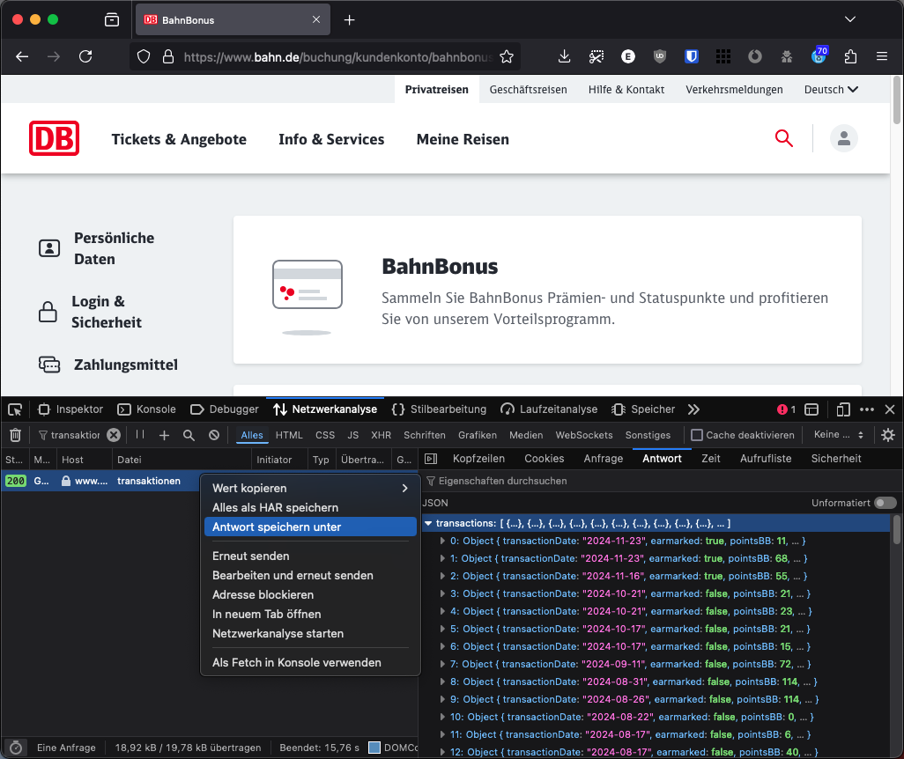

# BahnBonus Punkteverfall Rechner

In diesem Repository befindet sich ein Python-Skript, das Transaktionen von BahnBonus Punkten aus einer JSON-Datei (`transaktionen.json`) verarbeitet und die zu verfallenden Bonuspunkte pro Quartal für die drei Gültigkeitsjahre berechnet. Das Programm fragt nach dem aktuellen Bonuspunktestand (um anteilige Prämienausgaben zu berechnen) und gibt die Ergebnisse in der Konsole aus.

Die Idee kam daher, dass App und Webseite immer nur den Verfall zum Ende des aktuellen Quartals anzeigen. Wann jedoch mit dem Verfall von Punkten zu rechnen ist, ist nicht ersichtlich. Dieses Skript soll hierbei helfen.

## Disclaimer

Dieses Skript ist als spontane Idee entstanden und nicht offiziell von der Deutschen Bahn. Es wird keine Garantie für die Richtigkeit der Berechnungen übernommen. Tests wurden mit den eigenen Transaktionen durchgeführt, jedoch kann es zu Fehlern kommen. Bei Unstimmigkeiten sehr gerne ein Issue erstellen oder einen Pull Request einreichen.

## Voraussetzungen

- Python 3.8 or higher

## Installation

1. Dieses Repository klonen:
    ```sh
    git clone https://github.com/ErKi1998/BahnBonus-Punkteverfall-Rechner.git
    cd BahnBonus-Punkteverfall-Rechner
    ```

2. Sicherstellen, dass mindestens Python Version 3.8 installiert ist. Dazu kann folgender Befehl genutzt werden:
    ```sh
    python --version
    ```
   
## Erhalten der Transaktionsdaten
Um die Transaktionsdaten zu erhalten, die Seite [bahn.de/buchung/kundenkonto/bahnbonus](https://www.bahn.de/buchung/kundenkonto/bahnbonus) mit aktivierter Netzwerkanalyse besuchen und einloggen. Dort die Datei `transaktionen` auswählen und die Antwort als Datei mit dem Namen `transaktionen.json` speichern:



## Verwendung

1. Die Datei `transaktionen.json` in das Verzeichnis des Projekts kopieren. Hierbei die im Repository vorhandene Beispiel-Datei überschreiben.

2. Das Skript ausführen und den aktuellen Bonuspunktestand als Argument übergeben:
    ```sh
    python bahnbonus-calculator.py <aktuelle_bahn_bonus_punkte>
    ```

    Alternativ kann das Skript auch ohne Argumente ausgeführt werden. In diesem Fall wird bei der Ausführung nach dem aktuellen Bonuspunktestand gefragt:
    ```sh
    python bahnbonus-calculator.py
    ```

## Beispiel
Ruft man das Skript mit dem Argument `2266` und der im Repository als Beispiel vorhandenen `transaktionen.json`-Datei auf:
   ```sh
   python bahnbonus-calculator.py 2266
   ```
Erhält man folgende Ausgabe:
```
Pro Quartal gesammelte Punkte:
Q4 2024: 80
Q3 2024: 542
Q2 2024: 434
Q1 2024: 32
Q4 2023: 0
Q3 2023: 73
Q2 2023: 359
Q1 2023: 0
Q4 2022: 276
Q3 2022: 111
Q2 2022: 380
Q1 2022: 40
Q4 2021: 0

Summe der aus den Transaktionen berechneten Punkte: 2327
Aktuelle Anzahl der BahnBonus Punkte: 2266

Es gibt einen Unterschied von 61 Punkten. Dies stammt vrsl. von Premienausgaben. Dies wird nun berücksichtigt.

In Folgenden Quartalen laufen die Punkte ab:
Q4 2024: 0
Q1 2025: 0
Q2 2025: 359
Q3 2025: 111
Q4 2025: 276
Q1 2026: 0
Q2 2026: 359
Q3 2026: 73
Q4 2026: 0
Q1 2027: 32
Q2 2027: 434
Q3 2027: 542
Q4 2027: 80
```